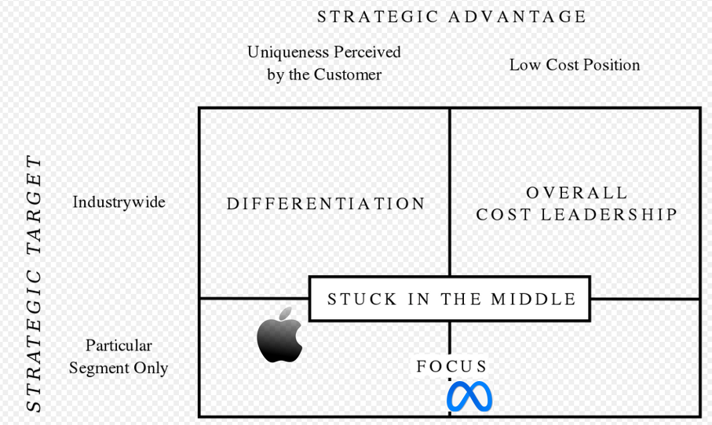
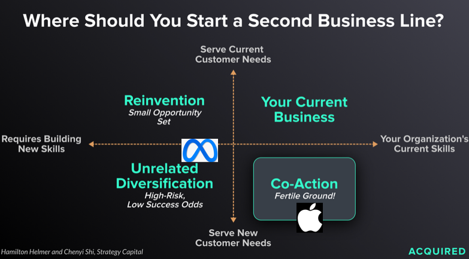

Apple’s unveiling of Apple Vision Pro and the reaction to it has made one thing clear.



A new era of computing  has dawned. Whether you call it spatial computing or virtual/mixed reality , it will almost certainly  reshape our digital lives in the decade to come. 

In many ways, what Apple has done with the Vision Pro is validate Mark Zuckerberg’s  bet on VR and AR beginning with Meta’s acquisition of Oculus in 2014.

What is fascinating is the strategic clarity demonstrated by these two companies in tackling this problem.

As Michael Porter has described, the essence of competitive strategy is about being different by choosing a different set of activities that fit and reinforce each other to deliver unique value to a specific set of customers.

To evaluate whether these two companies have clear competitive strategies, we can analyze both Apple and Meta’s VR strategy through Porter’s test of good strategy which consists of 5 themes.

> A unique value proposition
> 
> - Are you offering distinctive value to a chosen set of customers at the right relative price

> A tailored value chain
> 
> - Is the best set of activities to deliver your value proposition different from the activities performed by rivals?

> Trade-offs different from rivals
> 
> - Are you clear about what you don't do so that you can deliver your kind of value most efficiently and effectively?

> Fit across the value chain
> 
> - Is the value of your activities enhanced by the other activities you perform?

> Continuity over time
> 
> - Is there enough stability in the core of your strategy to allow your organization to get good at what it does, to foster tailoring, trade-offs and fit?

## A unique value proposition

### Apple

Apple has designed the Apple Vision Pro with a specific focus on entertainment and productivity. 

Disney Plus will be available on the Vision Pro when it is released while their demos focused on immersive experiences in sports.  Apple’s partnership with MLS means that this experience might be coming to MLS fans soon.

It also designed Vision OS to let you use iOS apps and browse the internet and even lets you work on your Mac while using the Vision IOS as a monitor. Apple has focused on more individualized use cases and their price point  of $3,500 reflects that. 

Apple has bet on Mixed Reality.

### Meta

Meta has designed the Meta Quest with a specific focus on gaming and social experiences.

It already comes with a library of over 500 video game titles. It also supports use cases such as work outs. It has designed Horizon worlds to deliver a social VR experience , consistent with the mission of the company to connect people.

The lower price point of $500 means that a lot more people can afford the Meta Quest, which is essential to delivering a social experience.

Meta has bet on Virtual Reality.

## A tailored value chain

### Apple

The Vision Pro is vertically integrated, with Apple developing the software (Vision OS) as well as hardware including 3D cameras, and the M2 and R2 chips. This is consistent with Apple’s focus on seamlessly integrating hardware and software.

### Meta

The Meta Quest is more modular. The Operating System for the Quest is based on Android while the chip comes from Qualcomm.

## Trade Offs different from rivals

The tradeoffs made by the two companies are already clear, based on the use cases they intend to solve for and the price points they are targeting.

Apple offers incredibly high resolution that makes it possible to even read text using the Vision Pro, a pre-requisite for productivity applications. It has an external battery that makes it less suitable for gaming or anything that involves physical activity. 

Meta Quest has settled for a lower resolution given the gaming use cases it is targeting. It also comes with the battery packed into the headset while also offering customer controllers for game play.

## Fit

The choices made by each company fits in with the overall mission of each company.

Apple has always been focused on creating delightful consumer products by tightly integrating hardware, software and services. The Vision Pro will be expected to join the ranks of Apple’s iconic devices like the iPhone, the Mac, and iPad enhancing the lineup of delightful personal computing devices. Vision OS will make using this new device seamless for anyone using other Apple products. Apple’s investments in iOS and the App Store is what makes Vision Pro possible and truly compelling.

For Meta, the Quest is a gateway to connecting people in virtual worlds. Presence really matters if you want to connect deeply with people. I felt this at a deeply personal level when my nephews visited me for the first time in almost 5 years. The connection I felt with them was unlike anything that a pure digital medium could afford.

 If the VR experience can be capture even a sliver of that profound connection when you are physically present with someone, Meta will be making a giant stride forward towards accomplishing its mission. Again Meta’s core investments in creating platforms that connect billions of people in the digital world will likely be key in making it the platform of choice to connect with others in the metaverse.
 
## Continuity Over Time

### Apple

No other company in the world has a focus and consistency in strategy as Apple. They are hyper focused on creating consumer technology products that you interact with every waking hour of the day. The Apple Brand is now the gold standard for quality and trust.

The Vision Pro represents a continuation of this strategy.

### Meta

Although the stock market thinks that Meta has erred in investing so heavily on the metaverse project, being a founder driven company means it can commit to a singular vision even if there are naysayers aplenty. Zuck should give Meta the continuity in strategy to pursue this to its conclusion.

## Differentiation vs Cost Leadership

Viewed through the lens of Porter’s generic strategies, Apple will be pursuing a high degree of differentiation for a larger set of tech visionaries interested in productivity and entertainment use cases.

Meta will strive for cost leadership with tech visionaries interested in gaming and social use cases. Given the emphasis on social use cases, Meta will be aggressively looking to drive down prices even at the expense of highly differentiated use cases so that more people can buy their devices.

## Risks

For both Apple and Meta, these bets represent a different risk profile.

iewing it through Hamilton Hemler’s and Chenyi Shi’s framework, it represents a far lesser risk for Apple given the power of its brand in consumer technology products and its strengths in creating tightly knit hardware and software (process power).

For Meta, this requires building new skills in developing consumer hardware which certainly takes it out of  its comfort zone - a very high margin advertising business with zero marginal cost. This is why the conviction and backing of its founder will be critical for success.

## Summary

Meta and Apple’s different approaches to VR/AR is one of the best examples I have seen of two companies showing clear strategic thinking in a drive to be unique. Is it any wonder that these two companies are jointly worth 3.75 trillions $ ?

